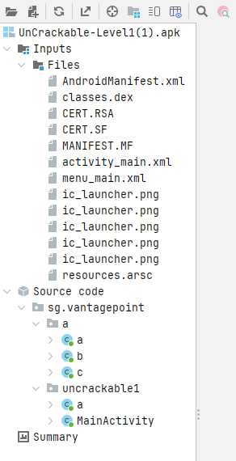
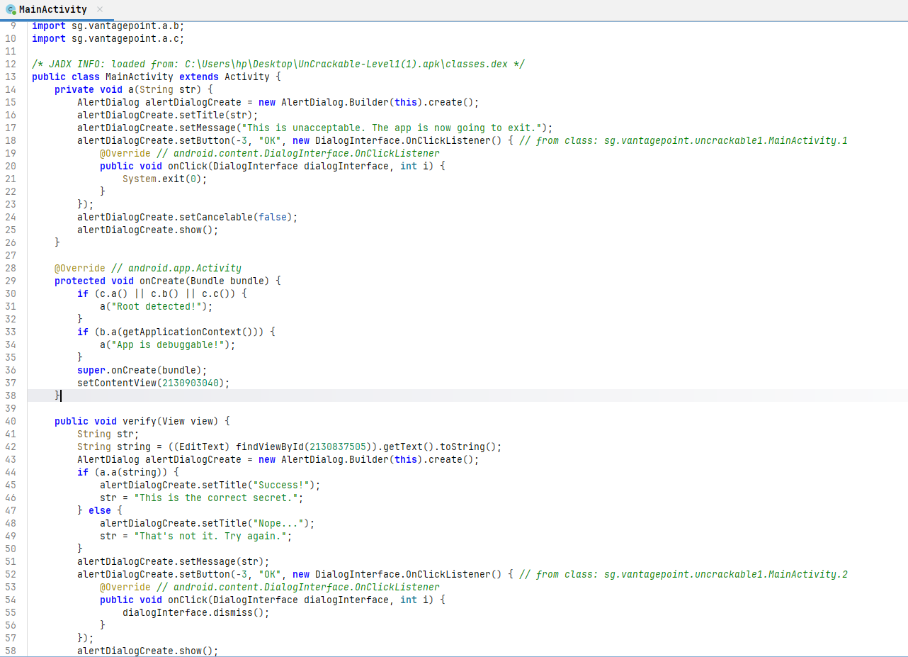
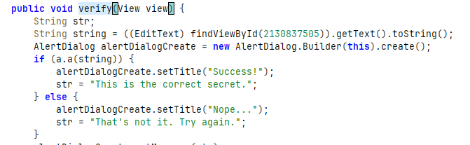
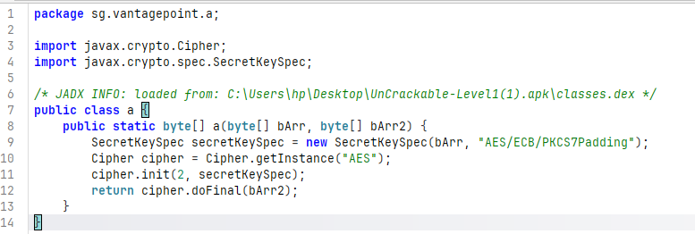
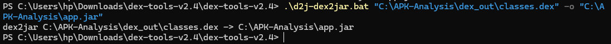
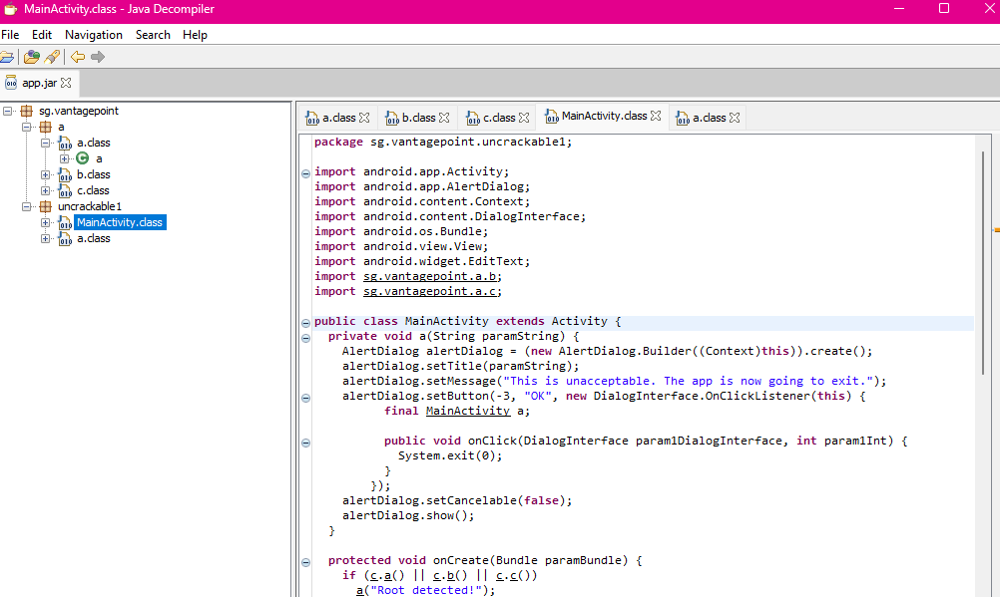

# 🔐 Analyse statique d’un APK Android – UnCrackable Level 1

## 🧠 Introduction

Dans ce projet, j’ai réalisé une **analyse statique** d’une application Android (fichier APK).
L’analyse statique signifie que je n’ai pas exécuté l’application, mais j’ai analysé son contenu (code et fichiers internes).

L’objectif est de comprendre comment fonctionne l’application et de trouver des failles de sécurité.

---

## 📦 Structure de l’APK

Un fichier APK est en réalité une archive ZIP contenant plusieurs fichiers importants :

* `AndroidManifest.xml` : contient les informations sur l’application (permissions, composants…)
* `classes.dex` : contient le code de l’application
* `res/` : contient les ressources (interface, textes…)

### 📸 Structure de l’APK dans JADX



---

## 🛠️ Outils utilisés

Pour réaliser cette analyse, j’ai utilisé :

* JADX : pour lire et analyser directement l’APK
* dex2jar : pour convertir le fichier `.dex` en `.jar`
* JD-GUI : pour analyser le fichier `.jar`

---

## 🔍 Analyse du code avec JADX

J’ai ouvert l’APK avec JADX et j’ai exploré le code.

J’ai trouvé la classe principale `MainActivity`.

Dans cette classe, j’ai identifié :

* une détection de root
* une détection de debug
* une fonction importante appelée `verify()`

### 📸 MainActivity



---

## 🔑 Logique de vérification

La fonction `verify()` récupère ce que l’utilisateur saisit et appelle une autre fonction :

```java
a.a(string)
```

Cela signifie que la vérification du secret est faite dans une autre classe.

Donc j’ai compris que le secret est stocké dans le code de l’application.

### 📸 Fonction de vérification



---

## 🔐 Chiffrement utilisé

En analysant le code, j’ai trouvé que l’application utilise :

AES/ECB/PKCS7Padding

Le mode ECB est connu pour être non sécurisé.

### 📸 AES ECB



---

## 🔄 Conversion DEX → JAR

J’ai extrait le fichier `classes.dex` et je l’ai converti en fichier `.jar` en utilisant dex2jar.

### 📸 Résultat dex2jar



---

## 🔍 Analyse avec JD-GUI

J’ai ouvert le fichier `.jar` avec JD-GUI pour comparer avec JADX.

J’ai remarqué que :

* JADX est plus adapté pour Android
* JD-GUI montre seulement le code Java

### 📸 JD-GUI



---

## ⚠️ Vulnérabilités trouvées

### 🔴 1. Logique sensible dans le code

Le secret est vérifié directement dans l’application.

👉 Problème : un attaquant peut lire le code et trouver le secret.

---

### 🔴 2. Chiffrement non sécurisé

L’application utilise AES en mode ECB.

👉 Problème : ce mode est vulnérable.

---

### 🟡 3. Protection faible

L’application détecte le debug et le root.

👉 Problème : ces protections peuvent être contournées.

---

## 🛠️ Solutions proposées

* Ne pas stocker de secret dans l’application
* Déplacer la vérification côté serveur
* Utiliser un chiffrement sécurisé (AES-GCM)
* Ajouter de l’obfuscation

---

## 🧠 Conclusion

Ce projet m’a permis de comprendre que :

* une application Android peut être analysée facilement
* le code côté client n’est pas sécurisé
* il ne faut jamais stocker des informations sensibles dans une application

J’ai appris les bases du reverse engineering et de l’analyse de sécurité.

---

## auteur

Fatimaezzahra Ennassiri


